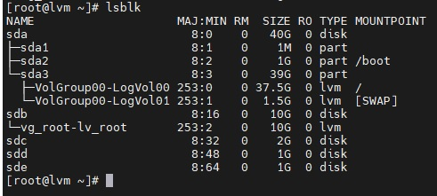
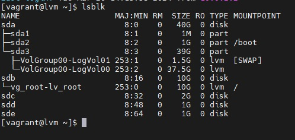
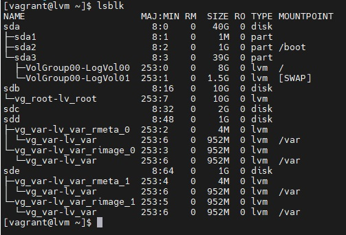
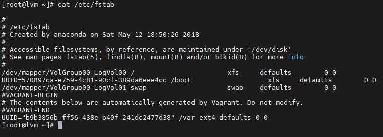
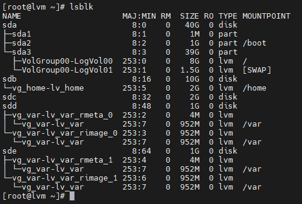
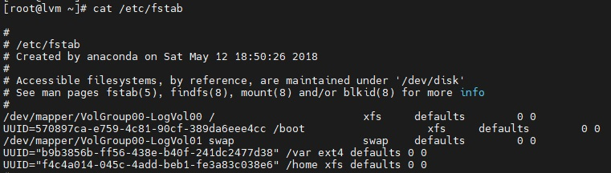

# Otus Homework 4. LVM
### Цель домашнего задания
Создавать и работать с логическими томами
### Описание домашнего задания
на имеющемся [образе](https://gitlab.com/otus_linux/stands-03-lvm) (centos/7 1804.2):
- уменьшить том под / до 8G
- выделить том под /home
- выделить том под /var (/var - сделать в mirror)
- для /home - сделать том для снэпшотов
- прописать монтирование в fstab

Работа со снапшотами:
- сгенерировать файлы в /home/
- снять снэпшот
- удалить часть файлов
- восстановиться со снэпшота

## Выполнение

Выполнение домашнего задание логировалось с помощью утилиты **script** и скриншотов.

### Уменьшить том под / до 8G


```
[root@lvm ~]# vgcreate vg_root /dev/sdb
  Physical volume "/dev/sdb" successfully created.
  Volume group "vg_root" successfully created
[root@lvm ~]# lvcreate -n lv_root -l +100%FREE vg_root
  Logical volume "lv_root" created.
[root@lvm ~]# mkfsx.xfs /dev/vg_root/lv_root
bash: mkfsx.xfs: command not found
[root@lvm ~]# mkfs.xfs /dev/vg_root/lv_root
meta-data=/dev/vg_root/lv_root   isize=512    agcount=4, agsize=655104 blks
         =                       sectsz=512   attr=2, projid32bit=1
         =                       crc=1        finobt=0, sparse=0
data     =                       bsize=4096   blocks=2620416, imaxpct=25
         =                       sunit=0      swidth=0 blks
naming   =version 2              bsize=4096   ascii-ci=0 ftype=1
log      =internal log           bsize=4096   blocks=2560, version=2
         =                       sectsz=512   sunit=0 blks, lazy-count=1
realtime =none                   extsz=4096   blocks=0, rtextents=0
[root@lvm ~]# mount /dev/vg_root/lv_root /mnt/
[root@lvm ~]# xfsdump -J - /dev/VolGroup00/LogVol00 | xfsrestore -J - /mnt
xfsrestore: using file dump (drive_simple) strategy
xfsrestore: version 3.1.7 (dump format 3.0)
xfsdump: using file dump (drive_simple) strategy
xfsdump: version 3.1.7 (dump format 3.0)
xfsdump: level 0 dump of lvm:/
xfsdump: dump date: Tue Mar 26 16:01:18 2024
xfsdump: session id: eb76c2c4-5746-4692-ae79-846f41d40ab1
xfsdump: session label: ""
xfsdump: ino map phase 1: constructing initial dump list
xfsrestore: searching media for dump
xfsdump: ino map phase 2: skipping (no pruning necessary)
xfsdump: ino map phase 3: skipping (only one dump stream)
xfsdump: ino map construction complete
xfsdump: estimated dump size: 897911232 bytes
xfsdump: creating dump session media file 0 (media 0, file 0)
xfsdump: dumping ino map
xfsdump: dumping directories
xfsrestore: examining media file 0
xfsrestore: dump description:
xfsrestore: hostname: lvm
xfsrestore: mount point: /
xfsrestore: volume: /dev/mapper/VolGroup00-LogVol00
xfsrestore: session time: Tue Mar 26 16:01:18 2024
xfsrestore: level: 0
xfsrestore: session label: ""
xfsrestore: media label: ""
xfsrestore: file system id: b60e9498-0baa-4d9f-90aa-069048217fee
xfsrestore: session id: eb76c2c4-5746-4692-ae79-846f41d40ab1
xfsrestore: media id: 1d0ff5f3-9b20-4941-9ce9-eb66181a0959
xfsrestore: searching media for directory dump
xfsrestore: reading directories
xfsdump: dumping non-directory files
xfsrestore: 2699 directories and 23623 entries processed
xfsrestore: directory post-processing
xfsrestore: restoring non-directory files
xfsdump: ending media file
xfsdump: media file size 874705360 bytes
xfsdump: dump size (non-dir files) : 861538528 bytes
xfsdump: dump complete: 37 seconds elapsed
xfsdump: Dump Status: SUCCESS
xfsrestore: restore complete: 37 seconds elapsed
xfsrestore: Restore Status: SUCCESS
[root@lvm ~]# for i in /proc/ /sys/ /dev/ /run/ /boot/; do mount --bind $i /mnt/$i; done
[root@lvm ~]# chroot /mnt/
[root@lvm /]# grub2-mkconfig -o /boot/grub2/grub.cfg
Generating grub configuration file ...
Found linux image: /boot/vmlinuz-3.10.0-862.2.3.el7.x86_64
Found initrd image: /boot/initramfs-3.10.0-862.2.3.el7.x86_64.img
done
[root@lvm /]# cd /boot ; for i in $(ls initramfs-*img); do dracut -v $i $(echo $i|sed "s/initramfs-//g; s/.img//g") --force; done
Executing: /sbin/dracut -v initramfs-3.10.0-862.2.3.el7.x86_64.img 3.10.0-862.2.3.el7.x86_64 --force
dracut module 'busybox' will not be installed, because command 'busybox' could not be found!
dracut module 'crypt' will not be installed, because command 'cryptsetup' could not be found!
dracut module 'dmraid' will not be installed, because command 'dmraid' could not be found!
dracut module 'dmsquash-live-ntfs' will not be installed, because command 'ntfs-3g' could not be found!
dracut module 'multipath' will not be installed, because command 'multipath' could not be found!
dracut module 'busybox' will not be installed, because command 'busybox' could not be found!
dracut module 'crypt' will not be installed, because command 'cryptsetup' could not be found!
dracut module 'dmraid' will not be installed, because command 'dmraid' could not be found!
dracut module 'dmsquash-live-ntfs' will not be installed, because command 'ntfs-3g' could not be found!
dracut module 'multipath' will not be installed, because command 'multipath' could not be found!
*** Including module: bash ***
*** Including module: nss-softokn ***
*** Including module: i18n ***
*** Including module: drm ***
*** Including module: plymouth ***
*** Including module: dm ***
Skipping udev rule: 64-device-mapper.rules
Skipping udev rule: 60-persistent-storage-dm.rules
Skipping udev rule: 55-dm.rules
*** Including module: kernel-modules ***
Omitting driver floppy
*** Including module: lvm ***
Skipping udev rule: 64-device-mapper.rules
Skipping udev rule: 56-lvm.rules
Skipping udev rule: 60-persistent-storage-lvm.rules
*** Including module: qemu ***
*** Including module: resume ***
*** Including module: rootfs-block ***
*** Including module: terminfo ***
*** Including module: udev-rules ***
Skipping udev rule: 40-redhat-cpu-hotplug.rules
Skipping udev rule: 91-permissions.rules
*** Including module: biosdevname ***
*** Including module: systemd ***
*** Including module: usrmount ***
*** Including module: base ***
*** Including module: fs-lib ***
*** Including module: shutdown ***
*** Including modules done ***
*** Installing kernel module dependencies and firmware ***
*** Installing kernel module dependencies and firmware done ***
*** Resolving executable dependencies ***
*** Resolving executable dependencies done***
*** Hardlinking files ***
*** Hardlinking files done ***
*** Stripping files ***
*** Stripping files done ***
*** Generating early-microcode cpio image contents ***
*** No early-microcode cpio image needed ***
*** Store current command line parameters ***
*** Creating image file ***
*** Creating image file done ***
*** Creating initramfs image file '/boot/initramfs-3.10.0-862.2.3.el7.x86_64.img' done ***
[root@lvm boot]# sudo sed -i 's/rd\.lvm\.lv=VolGroup00\/LogVol00/rd.lvm.lv=vg_root\/lv_root/g' /boot/grub2/grub.cfg
```
> После перезагрузки / примонтирован в новый Logical Volume
 


> Пересоздаем исходный LV и проделываем все то же самое наоборот

```
[root@lvm ~]# lvremove /dev/VolGroup00/LogVol00
Do you really want to remove active logical volume VolGroup00/LogVol00? [y/n]: y
  Logical volume "LogVol00" successfully removed
[root@lvm ~]# lvcreate -n LogVol00 -L 8G VolGroup00
WARNING: xfs signature detected on /dev/VolGroup00/LogVol00 at offset 0. Wipe it? [y/n]: y
  Wiping xfs signature on /dev/VolGroup00/LogVol00.
  Logical volume "LogVol00" created.
[root@lvm ~]# mkfs.xfs /dev/VolGroup00/LogVol00
meta-data=/dev/VolGroup00/LogVol00 isize=512    agcount=4, agsize=524288 blks
         =                       sectsz=512   attr=2, projid32bit=1
         =                       crc=1        finobt=0, sparse=0
data     =                       bsize=4096   blocks=2097152, imaxpct=25
         =                       sunit=0      swidth=0 blks
naming   =version 2              bsize=4096   ascii-ci=0 ftype=1
log      =internal log           bsize=4096   blocks=2560, version=2
         =                       sectsz=512   sunit=0 blks, lazy-count=1
realtime =none                   extsz=4096   blocks=0, rtextents=0
[root@lvm ~]# mount /dev/VolGroup00/LogVol00 /mnt
[root@lvm ~]# xfsdump -J - /dev/vg_root/lv_root | xfsrestore -J - /mnt
xfsrestore: using file dump (drive_simple) strategy
xfsrestore: version 3.1.7 (dump format 3.0)
xfsdump: using file dump (drive_simple) strategy
xfsdump: version 3.1.7 (dump format 3.0)
xfsdump: level 0 dump of lvm:/
xfsdump: dump date: Tue Mar 26 16:49:51 2024
xfsdump: session id: 822c9d77-65e1-46d0-93fa-ec4aea693db3
xfsdump: session label: ""
xfsrestore: searching media for dump
xfsdump: ino map phase 1: constructing initial dump list
xfsdump: ino map phase 2: skipping (no pruning necessary)
xfsdump: ino map phase 3: skipping (only one dump stream)
xfsdump: ino map construction complete
xfsdump: estimated dump size: 896286720 bytes
xfsdump: creating dump session media file 0 (media 0, file 0)
xfsdump: dumping ino map
xfsdump: dumping directories
xfsrestore: examining media file 0
xfsrestore: dump description:
xfsrestore: hostname: lvm
xfsrestore: mount point: /
xfsrestore: volume: /dev/mapper/vg_root-lv_root
xfsrestore: session time: Tue Mar 26 16:49:51 2024
xfsrestore: level: 0
xfsrestore: session label: ""
xfsrestore: media label: ""
xfsrestore: file system id: dd79a1d1-f829-44d8-891a-7eb2a2011a99
xfsrestore: session id: 822c9d77-65e1-46d0-93fa-ec4aea693db3
xfsrestore: media id: ca346ab9-2c3e-4e5e-97ec-f18d62087326
xfsrestore: searching media for directory dump
xfsrestore: reading directories
xfsdump: dumping non-directory files
xfsrestore: 2703 directories and 23628 entries processed
xfsrestore: directory post-processing
xfsrestore: restoring non-directory files
xfsdump: ending media file
xfsdump: media file size 873309080 bytes
xfsdump: dump size (non-dir files) : 860138608 bytes
xfsdump: dump complete: 32 seconds elapsed
xfsdump: Dump Status: SUCCESS
xfsrestore: restore complete: 32 seconds elapsed
xfsrestore: Restore Status: SUCCESS
[root@lvm ~]# for i in /proc/ /sys/ /dev/ /run/ /boot/; do mount --bind $i /mnt/$i; done
[root@lvm ~]# chroot /mnt/
[root@lvm /]# grub2-mkconfig -o /boot/grub2/grub.cfg
Generating grub configuration file ...
Found linux image: /boot/vmlinuz-3.10.0-862.2.3.el7.x86_64
Found initrd image: /boot/initramfs-3.10.0-862.2.3.el7.x86_64.img
done
[root@lvm /]# cd /boot ; for i in $(ls initramfs-*img); do dracut -v $i $(echo $i|sed "s/initramfs-//g; s/.img//g") --force; done
Executing: /sbin/dracut -v initramfs-3.10.0-862.2.3.el7.x86_64.img 3.10.0-862.2.3.el7.x86_64 --force
dracut module 'busybox' will not be installed, because command 'busybox' could not be found!
dracut module 'crypt' will not be installed, because command 'cryptsetup' could not be found!
dracut module 'dmraid' will not be installed, because command 'dmraid' could not be found!
dracut module 'dmsquash-live-ntfs' will not be installed, because command 'ntfs-3g' could not be found!
dracut module 'multipath' will not be installed, because command 'multipath' could not be found!
dracut module 'busybox' will not be installed, because command 'busybox' could not be found!
dracut module 'crypt' will not be installed, because command 'cryptsetup' could not be found!
dracut module 'dmraid' will not be installed, because command 'dmraid' could not be found!
dracut module 'dmsquash-live-ntfs' will not be installed, because command 'ntfs-3g' could not be found!
dracut module 'multipath' will not be installed, because command 'multipath' could not be found!
*** Including module: bash ***
*** Including module: nss-softokn ***
*** Including module: i18n ***
*** Including module: drm ***
*** Including module: plymouth ***
*** Including module: dm ***
Skipping udev rule: 64-device-mapper.rules
Skipping udev rule: 60-persistent-storage-dm.rules
Skipping udev rule: 55-dm.rules
*** Including module: kernel-modules ***
Omitting driver floppy
*** Including module: lvm ***
Skipping udev rule: 64-device-mapper.rules
Skipping udev rule: 56-lvm.rules
Skipping udev rule: 60-persistent-storage-lvm.rules
*** Including module: qemu ***
*** Including module: resume ***
*** Including module: rootfs-block ***
*** Including module: terminfo ***
*** Including module: udev-rules ***
Skipping udev rule: 40-redhat-cpu-hotplug.rules
Skipping udev rule: 91-permissions.rules
*** Including module: biosdevname ***
*** Including module: systemd ***
*** Including module: usrmount ***
*** Including module: base ***
*** Including module: fs-lib ***
*** Including module: shutdown ***
*** Including modules done ***
*** Installing kernel module dependencies and firmware ***
*** Installing kernel module dependencies and firmware done ***
*** Resolving executable dependencies ***
*** Resolving executable dependencies done***
*** Hardlinking files ***
*** Hardlinking files done ***
*** Stripping files ***
*** Stripping files done ***
*** Generating early-microcode cpio image contents ***
*** No early-microcode cpio image needed ***
*** Store current command line parameters ***
*** Creating image file ***
*** Creating image file done ***
*** Creating initramfs image file '/boot/initramfs-3.10.0-862.2.3.el7.x86_64.img' done ***
```
> Перед тем, как перезагрузиться выполним задачу по переносу /var/
### Выделить том под /var (/var - сделать в mirror)
```
[root@lvm boot]# vgcreate vg_var /dev/sdd /dev/sde
  Physical volume "/dev/sdd" successfully created.
  Physical volume "/dev/sde" successfully created.
  Volume group "vg_var" successfully created
[root@lvm boot]# lvcreate -n lv_var -m1 -L 950M vg_var
  Rounding up size to full physical extent 952.00 MiB
  Logical volume "lv_var" created.
[root@lvm boot]# lvs
  LV       VG         Attr       LSize   Pool Origin Data%  Meta%  Move Log Cpy%Sync Convert
  LogVol00 VolGroup00 -wi-ao----   8.00g
  LogVol01 VolGroup00 -wi-ao----   1.50g
  lv_root  vg_root    -wi-ao---- <10.00g
  lv_var   vg_var     rwi-a-r--- 952.00m                                    100.00
[root@lvm boot]# mkfs.ext4 /dev/vg_var/lv_var
mke2fs 1.42.9 (28-Dec-2013)
Filesystem label=
OS type: Linux
Block size=4096 (log=2)
Fragment size=4096 (log=2)
Stride=0 blocks, Stripe width=0 blocks
60928 inodes, 243712 blocks
12185 blocks (5.00%) reserved for the super user
First data block=0
Maximum filesystem blocks=249561088
8 block groups
32768 blocks per group, 32768 fragments per group
7616 inodes per group
Superblock backups stored on blocks:
        32768, 98304, 163840, 229376

Allocating group tables: done
Writing inode tables: done
Creating journal (4096 blocks): done
Writing superblocks and filesystem accounting information: done

[root@lvm boot]# mount /dev/vg_var/lv_var /mnt
[root@lvm boot]# cp -aR /var/* /mnt/
[root@lvm boot]# mkdir /tmp/var.bak
[root@lvm boot]# mv /var/* /tmp/var.bak/
[root@lvm boot]# umount /mnt/
[root@lvm boot]# mount /dev/vg_var/lv_var /var
[root@lvm boot]# echo "`blkid | grep var: | awk '{print $2}'` /var ext4 defaults 0 0" >> /etc/fstab
```

> В /etc/fstab добавлена запись для монтирования /var


### Выделить том под /home
```
[root@lvm ~]# lvremove /dev/vg_root/lv_root
Do you really want to remove active logical volume vg_root/lv_root? [y/n]: y
  Logical volume "lv_root" successfully removed
[root@lvm ~]# vgremove /dev/vg_root
  Volume group "vg_root" successfully removed
[root@lvm ~]# pvremove /dev/sdb
  Labels on physical volume "/dev/sdb" successfully wiped.
[root@lvm ~]#
[root@lvm ~]#
[root@lvm ~]#
[root@lvm ~]# vgcreate vg_home /dev/sdb
  Physical volume "/dev/sdb" successfully created.
  Volume group "vg_home" successfully created
[root@lvm ~]# lvcreate -n lv_home -L 2G vg_home
WARNING: xfs signature detected on /dev/vg_home/lv_home at offset 0. Wipe it? [y/n]: y
  Wiping xfs signature on /dev/vg_home/lv_home.
  Logical volume "lv_home" created.
[root@lvm ~]# mkfs.xfs /dev/vg_home/lv_home
meta-data=/dev/vg_home/lv_home   isize=512    agcount=4, agsize=131072 blks
         =                       sectsz=512   attr=2, projid32bit=1
         =                       crc=1        finobt=0, sparse=0
data     =                       bsize=4096   blocks=524288, imaxpct=25
         =                       sunit=0      swidth=0 blks
naming   =version 2              bsize=4096   ascii-ci=0 ftype=1
log      =internal log           bsize=4096   blocks=2560, version=2
         =                       sectsz=512   sunit=0 blks, lazy-count=1
realtime =none                   extsz=4096   blocks=0, rtextents=0
[root@lvm ~]# mount /dev/vg_home/lv_home /mnt/
[root@lvm ~]# cp -aR /home/* /mnt
[root@lvm ~]# rm -rf /home/*
[root@lvm ~]# umount /mnt/
[root@lvm ~]# mount /dev/vg_home/lv_home /home
[root@lvm ~]# echo "`blkid | grep home| awk '{print$2}'` /home xfs defaults 0 0" >> /etc/fstab
```

> В /etc/fstab добавлена запись для монтирования /home


### Для /home - сделать том для снэпшотов
```
[root@lvm ~]# touch /home/file{1..20}
[root@lvm ~]# ls /home
file1  file10  file11  file12  file13  file14  file15  file16  file17  file18  file19  file2  file20  file3  file4  file5  file6  file7  file8  file9  vagrant
[root@lvm ~]# lvcreate -n snap_home -L 1G -s /dev/vg_home/lv_home
  Logical volume "snap_home" created.
[root@lvm ~]# rm -f /home/file{10..20}
[root@lvm ~]# ls /home/
file1  file2  file3  file4  file5  file6  file7  file8  file9  vagrant
[root@lvm ~]# umount /home/
[root@lvm ~]# lvconvert --merge /dev/vg_home/snap_home
  Merging of volume vg_home/snap_home started.
  vg_home/lv_home: Merged: 100.00%
[root@lvm ~]# mount /home
[root@lvm ~]# ls /home
file1  file10  file11  file12  file13  file14  file15  file16  file17  file18  file19  file2  file20  file3  file4  file5  file6  file7  file8  file9  vagrant
```
